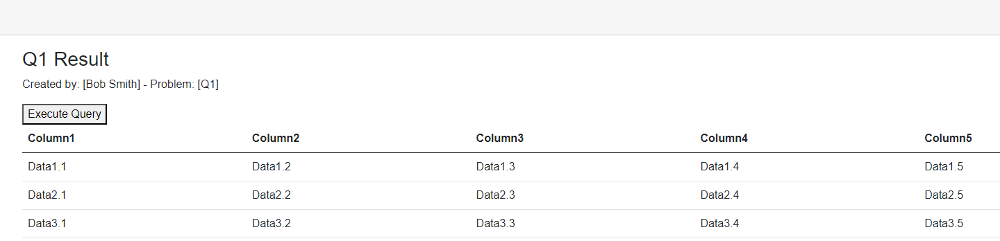

# Take-Home Exercise: Building Blazor Web Applications with LINQ Queries (Team Exercise)
 

| Earned | Criterion                                              | Points | Description                                                                                                     |
|--------|--------------------------------------------------------|--------|-----------------------------------------------------------------------------------------------------------------|
|        | **1. Blazor Application Structure**                    | 5      | Fully structured Blazor application with Index page, Solutions folder, and Q1-Q5 pages.                         |
|        |                                                        | 3-4    | Partially completed with some elements or pages missing or improperly structured.                               |
|        |                                                        | 1-2    | Several elements or pages missing or significantly improperly structured.                                       |
|        |                                                        | 0      | Many elements missing or not attempted.                                                                         |
|        | **2. Functionality of Blazor Pages (Code Behind)**     | 5      | Correct functionality with code behind handling LINQ queries and displaying results with required elements.     |
|        |                                                        | 3-4    | Partial functionality; some pages' code behind are incomplete or not functioning correctly.                     |
|        |                                                        | 1-2    | Most pages' code behind are non-functional or significantly flawed in functionality.                           |
|        |                                                        | 0      | Little to no functionality; code behind for most pages are non-functional.                                      |
|        | **3. Secret Storage and Program.cs Configuration**     | 1      | Successful implementation of Secret storage and necessary Program.cs updates.                                   |
|        |                                                        | 0      | No implementation or significant errors in implementation.                                                      |
|        | **4. Class Library Implementation**                    | 4      | Fully implemented class library with Extension class, DAL & Entities, refactored Entities and Context, etc.     |
|        |                                                        | 2-3    | Partial implementation with some components missing or not correctly implemented.                               |
|        |                                                        | 1      | Significant parts of the implementation are missing or incorrect.                                               |
|        |                                                        | 0      | Little to no implementation of the required components.                                                         |
|        | **Penalties (up to -5 points)**                        |        |                                                                                                                 |
|        | Inadequate GitHub Check-ins, Poor Code Documentation, Non-Adherence to Coding Standards, etc. | -1 to -5 | Deductions for inadequate GitHub check-ins, poor code documentation, non-adherence to coding standards, etc.     |
|        | **Note:**                                              |        | A mark of "0" will be given if the application does not run.                                                    |
|        | **Total**                                              | 15     |                                                                                                                 |

**Total Points: 15 (Maximum Penalty Deduction: 5 Points)**

## Objective
This team-based exercise, intended for pairs of students, is designed to build upon your previous individual LINQ queries project. Together with your partner, you will develop a Blazor web application that displays the results of your LINQ queries on five separate web pages. This collaborative project will not only deepen your understanding of Blazor applications, class libraries, dependency injections, and Entity Framework but also enhance your skills in teamwork and joint problem-solving.

## Requirements

### 1. Project Structure
- **Create a Blazor Application and a Class Library:** As a team, develop a solution that includes a Blazor web application and a separate class library.

### 2. Blazor Web Application
- **Index Page:** The index page should list the names of both team members.
- **Solution Folder:** Together, create a folder named "Solutions" within the pages folder.
- **Query Pages:** Collaboratively develop 5 Blazor pages with code-behind files named Q1 - Q5 in the solution folder.
- **Navigation Menu:** Implement navigation menu items for each query page (Q1 - Q5).
- **Secret Storage:** Utilize the "Secret" mechanism for storing the database connection string.
- **Program.cs Updates:** Update the "Program.cs" file as necessary for your application configuration.
- **Page Requirements:** Each of the five pages, collaboratively designed, should include:
  - The names of the students responsible for the page's creation and the problem name at the top.
  - A button to execute the corresponding query.
  - An HTML table using the "TableTemplate" razor component to display query results (note: pagination is not required).
  - Dependency injections of the service from the class library "BLL".
  - Code to call the corresponding method in "BLL" when the query button is pressed.

### 3. Class Library
- **Extension Class:** Include a class for managing dependencies.
- **Data Access Layer (DAL) & Entities:** Create these using the EF Power Tools.
- **Refactor Entities and Context:** Ensure property access levels reflect what was demonstrated in class.
- **View Models:** Create a view model for each question (Q1View to Q5View).
- **Services:** Develop individual services for each question (Q1Service to Q5Service), each containing a method (Q1Result to Q5Results) to retrieve query results.  **NOTE:  Your LINQ queries needs to be refactor to be "Strongly Type".**

### 4. Version Control
- **GitHub Check-ins:** Continuous and regular check-ins on GitHub are a crucial part of this project. It is essential for both team members to commit changes to the repository consistently as the project progresses. This practice not only ensures that your work is safely versioned but also demonstrates an ongoing and collaborative development process. While there is no set minimum number of check-ins, remember that sporadic or last-minute commits are strongly discouraged and may impact your project evaluation (Penalties). Regular check-ins reflect professional development practices and are key to a successful team collaboration. 

## Submission Guidelines
- **Deadline:** [Monday Feb 26 @ Midnight]
- **Submission Method:** GitHub repository.
- **Teamwork:** Clearly document the roles and contributions of each team member in your project.

## Evaluation Criteria
Your project, as a team effort, will be evaluated based on the following criteria:
- Correct implementation of Blazor pages and class library requirements.
- Functionality and accuracy of LINQ queries and their integration into the web application.
- Adherence to coding standards and best practices discussed in class.
- Regular and meaningful GitHub check-ins.

