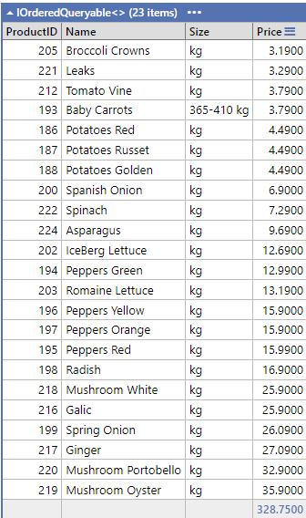
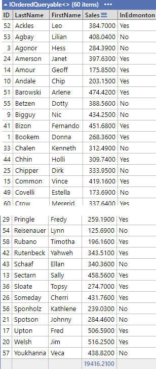
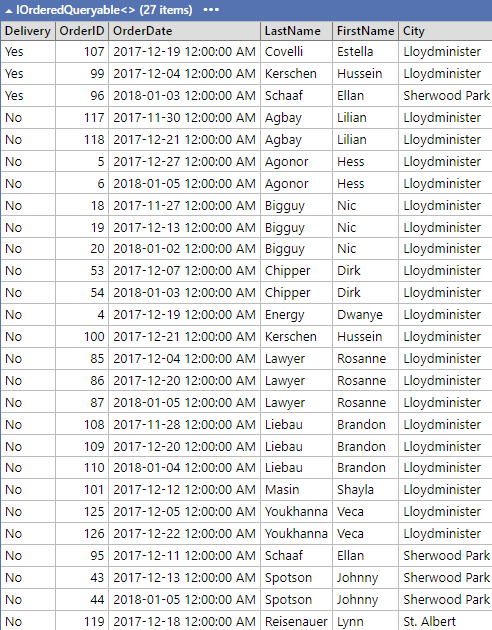
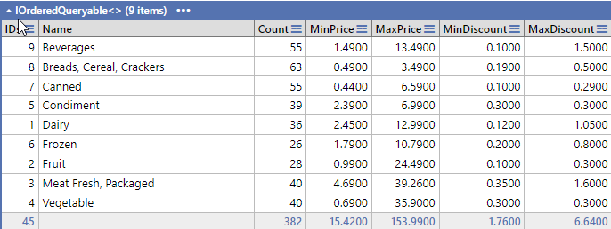
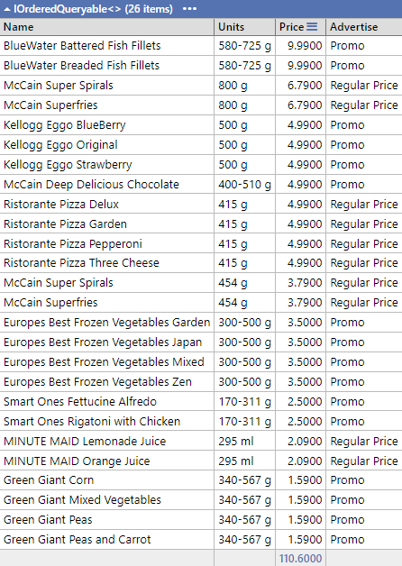

# LINQ and LinqPad Exercise - Part 1 (5 Marks)

## Private GitHub Repo Only

This exercise is based on the Grocery List database that is found in Moodle. For this exercise, you must use LINQPad and provide your answers as LinqPad (.linq) document(s) in a **single LinqPad document** containing all questions (you will need to use Statements as the LinqPad environment). You **must** do a commit after completing each question.  **Please review each image provide as there maybe information within that will help you answer your questions.**

1. You are managing the inventory for a grocery store. You need to find all products that belong to the "Vegetables" category and have a price that is greater than 3 dollar. List the Product IDs, Descriptions, Size and Price of all products.  Order by price.

    

1. As a customer service manager, you want to organize customer records. Since you are concern of the rising cost of fuel for your delivery vans, you want to see which customers are not from Edmonton. Create a list that sort all customers first by their last name and then by their first name in ascending order, retrieving their Customer ID, Last Name, and First Name, total sales and whether they are located in Edmonton.

    

1. You're analyzing sales data for a marketing report. At this time, you are focus on those communities that are outside of the Edmonton and Calgary.  Show the following information: Delivery, Order ID, Order Date, Customer's Last Name, First Name, City.  Show those order that have been delivery first then city, last name and finally order date.

    

1. As the manager for the grocery store, you need an overview of your products, pricing and discounts. You need to see a list of all product categories,their Id's and the number of products within each one.  You also need to understand the range of pricing and discounts.  Create a list showing categories description, category ID's, minimum and maximum prices and discount within each category.  **For the minimum discount, we want to see the minimum discount that is greater than zero**.  Order by category description.

    

1. Now that we have a information on our categories, we want to create a pricing list for the "Frozen" items. Create a list showing Description, Units, applying the adjusted price if there is a discount. Also show whether there is a discount apply.  Order by adjusted price descending then name.

    
