# Take-Home #4: Building Blazor Web Applications usinig OLTP LINQ Queries/Methods
 

| Earned | Criterion                                              | Points | Description                                                                                                     |
|--------|--------------------------------------------------------|--------|-----------------------------------------------------------------------------------------------------------------|
|        | **1. Blazor Member Search/Code Behind**                | 3      | Fully structured Blazor application with Member search page & code behind following coding standard (NOTE: Propagation is not required).                         |                           |
|        |                                                        | 1-2    | Several elements or pages missing or significantly improperly structured.                                       |
|        |                                                        | 0      | Many elements missing or not attempted.|
|        | **2. Blazor Member Add & Edit with cars collections/Code Behind (Parent/Childrens)**            | 5      | Fully structured Blazor application with Member add/edit with adding cars & code behind following coding standard.                         |
|        |                                                        | 3-4    | Partially completed with some elements or pages missing or improperly structured.                               |
|        |                                                        | 1-2    | Several elements or pages missing or significantly improperly structured.                                       |
|        |                                                        | 0      | Many elements missing or not attempted.|
|        | **3. Configuration**     | 2      | Successful implementation of Program.cs, page navigation & Extensions.                                   |
|        |                                                        | 1      | Significant parts of the implementation are missing or incorrect.                                               |
|        |                                                        | 0      | Little to no implementation of the required components.|                                                      
|        | **4. Class Library Implementation**                    | 5      | Fully implemented class library with Extension class.  NOTE: DAL & Entities have already been created.     |
|        |                                                        | 3-4    | Partially completed with some elements missing or improperly structured.                               |
|        |                                                        | 1-2    | Several elements or pages missing or significantly improperly structured.                                       |
|        |                                                        | 0      | Many elements missing or not attempted.|
|        | **Penalties (up to -5 points)**                        |        |                                                                                                                 |
|        | Inadequate GitHub Check-ins, Poor Code Documentation, Non-Adherence to Coding Standards, etc. | -1 to -5 | Deductions for inadequate GitHub check-ins, poor code documentation, non-adherence to coding standards, etc.     |
|        | **Note:**                                              |        | A mark of "0" will be given if the application does not run.                                                    |
|        | **Total**                                              | 15     |                                                                                                                 |

**Total Points: 15 (Maximum Penalty Deduction: 5 Points)**
# NOTE:  A starter project has been included for you to begin with.
## Objective
Develop a structured Blazor application focused on ERacing, where you will create a member search page enabling searches based on last names, along with functionality to edit existing members or add new ones. The application will include a feature to manage member demographics and a collection of associated cars. Additionally, you will be tasked with creating a BLL (Business Logic Layer) service for members, incorporating search functionality and add/edit operations. Member view models will include a list of CarView objects.

To encapsulate the requirements and functionality of the application as described in the code you've provided, we're looking at a member management system for a racing club or similar organization. This system is designed to handle a variety of tasks related to managing members, their certifications, and their vehicles. Here are the key requirements and features based on the detailed code you shared:

## Application Overview
The application is a web-based platform that provides functionalities for managing club members and their racing vehicles. It allows users to search for members, add new members, edit existing member information, and manage member-owned vehicles.

## Core Features and Business Rules
### Member Search and Management:
- Users can search for members by their last name.
- The system supports adding new members and editing existing member details.
- Each member has personal information such as first name, last name, address, city, postal code, phone number, email address, birthdate, and certification level.

### Vehicle Management:
- Members can own multiple racing vehicles.
- Each vehicle has details including a description, serial number, ownership status, state (condition), and class.
- The application allows adding new vehicles to a member's profile and editing existing vehicle details.
- Vehicles can be marked for removal from the member's profile.

### Certification Tracking:
- Members possess certifications that qualify them for participation in races. These certifications are tracked within the system.

### Comprehensive Error Handling and User Feedback:
- The system implements error handling to capture and respond to runtime errors, invalid inputs, and other exceptions.
- Clear feedback messages are provided to users based on the success or failure of their actions.

### Data Validation:
- Client-side and server-side validation ensure the integrity and correctness of user input.
- Data annotations are utilized to enforce validation rules on data models.

### Navigation and Routing:
- The application supports navigation to different pages for member and vehicle management, leveraging Blazor's routing capabilities.

### Project Requirements

#### 1. Project Structure (**2 Marks**)
- **Solution Setup:** Create and updated supporting files need for the Blazor application to run.
  - **Navigation Menu:** Implement navigation menu items to navigate to the *Member Search*
  - **appsetting.json:** Update with your server and database information.
  - **Program.cs:** Update the "Program.cs" file as necessary for your application configuration.
  - **Extension Class:** Include a class for managing dependencies.

### 2. Blazor Web Application
- **Member Search Page:**  (**3 Marks**)
  - This page should contain a list of members.
  - **New Button** for creating a new member.  After clicking the *New* button, the application will then load the member page for creating a new member. 
  - **Search Area:** for search for existing members.
    - **Last Name:** A text box for use in searching using the members last name.
    - **Search Button:** A search button for returning a list of member based on the last name.
  - **Search Result Area**
    - An HTML table using the "TableTemplate" razor component to display query results order by last name (note: pagination is not required).
    - **Edit Button** for editing an existing member.  After clicking the *Edit* button, the application will then load the member page with the selected member information.
- **Member Page:**  (**5 Marks**)
  - This page is used to add/edit members along with adding/editing/(soft deleting) their cars.  
  - **Member Area:** Area in which the member information is added/updated.
    - **New Button** for adding a new car.
  - **List of Cars** Area for adding/editing or removing cars.  By default, you can edit an existing car by just updating the value in the table. 
    - An HTML table using the "TableTemplate" razor component to display car results (note: pagination is not required).
    - **Remove Button**
      - Sets *"RemoveFromViewFlag"* to true for any existing cars.
      - **Removes the car object if the car has NOT been save to the database**.
  - **Save Button** for saving data and return to member search page.
  - **Cancel Button** for discarding changes and return to member search page.  NOTE:  No confirmation will be needed to confirm the cancellation.
  
### Adding or Editing a Member Requirements
  - **First Name** is required.
  - **Last Name** is required.
  - **Phone** is required.
  - **Address** is required.
  - **City** is required.
  - **Postal code** is required.
  - **Email** is required.
  - The **age of the member** is less than 100 years.
  - **Certification level** is required.
  - A **minimum of 1 car** is needed per member.

### Adding or Editing a Car Requirements
  - **Description** is required.
  - **Serial Number** is required.  **NOTE:  This must be a unique serial number.**
  - **Ownership** is required.
  - **State** is required.
  - **Car class** is required.

  
## NOTE:  For all Blazor pages:
- ### Footers used for feedback must be on each Blazor page.
- ### All methods must contain a try/catch area.
  
---
### 3. Class Library (**5 Marks**)
- **Extension Class:** Include a class for managing dependencies.
- **Services:** Update the member services.
  - Constructor
  - GetMembers method.
  - AddEditMember method.
  - **Ensure that all of your business rules are coded within your methods**
- **Data Access Layer (DAL) & View Models:** This has been created and does not need to be change.

### 4. Version Control
- **GitHub Check-ins:** Continuous and regular check-ins on GitHub are a crucial part of this project. It is essential for you to commit changes to the repository consistently as the project progresses. This practice not only ensures that your work is safely versioned but also demonstrates an ongoing and collaborative development process. While there is no set minimum number of check-ins, remember that sporadic or last-minute commits are strongly discouraged and may impact your project evaluation (Penalties). Regular check-ins reflect professional development practices and are key to a successful team collaboration. 
## Submitting only once or infrequently will result in penalties for not conducting regular check-ins.

## Submission Guidelines
- **Deadline:** [Monday April 8 @ Midnight]
- **Submission Method:** GitHub repository.

## Evaluation Criteria
Your project will be evaluated based on the following criteria:
- Correct implementation of Blazor pages and class library requirements.
- Functionality and accuracy of LINQ queries/transactional methods and their integration into the web application.
- Adherence to coding standards and best practices discussed in class.
- **Regular and meaningful GitHub check-ins.**

## Naming Conventions:

- **Use meaningful, descriptive names for variables, methods, components, and namespaces.** For example, `MemberService` clearly indicates a service handling member-related operations.
- **Use camelCase for private fields and parameters, PascalCase for methods, properties, classes, and namespaces.**

## Component Structure:

- **Clearly separate the logic and presentation layers.** Business logic should be in code blocks or separate classes, while UI components focus on display and user interaction.

## Error Handling:

- **Implement comprehensive error handling,** including try-catch blocks for capturing runtime errors and validating user input to prevent exceptions.

## User Feedback:

- **Provide clear user feedback for actions,** including successful operations and errors. Use the `feedbackMessage` and `errorMessage` variables effectively.

## Consistent Styling:

- **Comment critical sections of the code,** especially where complex logic is involved. Include summaries for methods and descriptions of their parameters and return values.
- **Implement both client-side (adding car to member cars) and server-side validation (saving data) to ensure data integrity.** Use data annotations where applicable and provide clear error messages.

# Screen Shots

### Menu
---
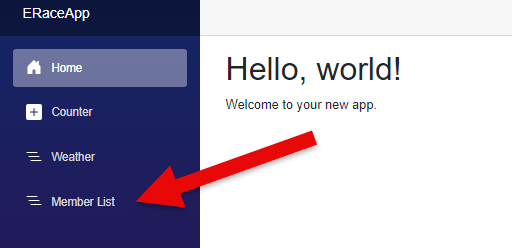
 
### Initial Member List
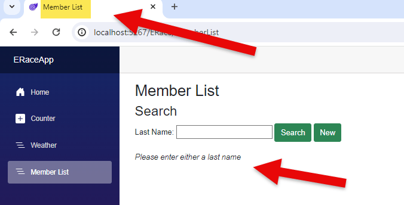
 
### Member List
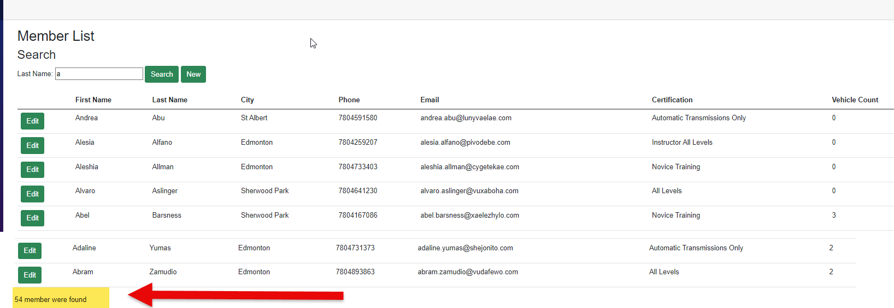
 
### New Member
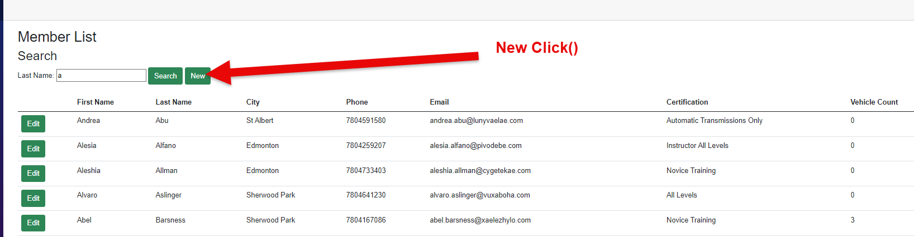
---
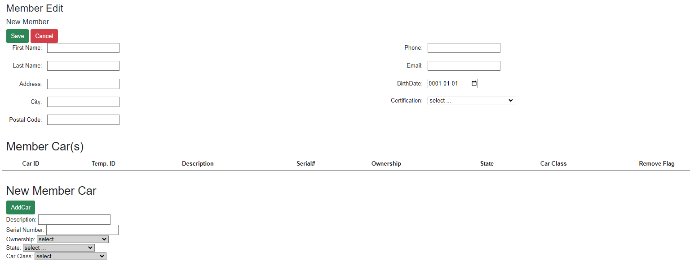
 
### Existing Member
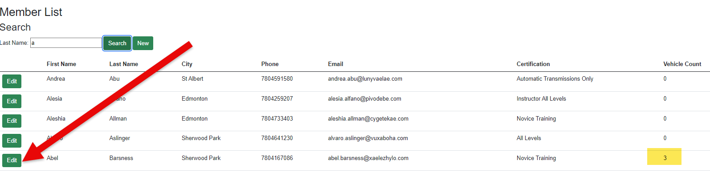
---
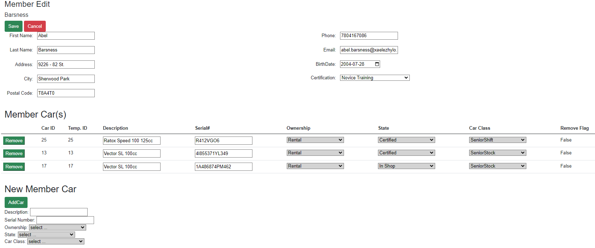
 
### Adding New Car
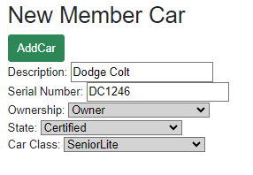
---
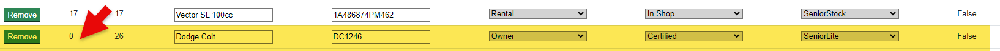

### Drop Downs
---
### Certification (Lookup)
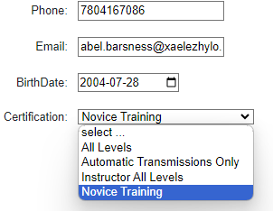
---
 

### Ownership (Statically Defined list.)
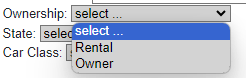
---
 

### State (Statically Defined list.)
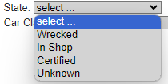
---
 

### Car Class (Lookup)
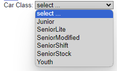

## Error Messages
### Saving Members Data
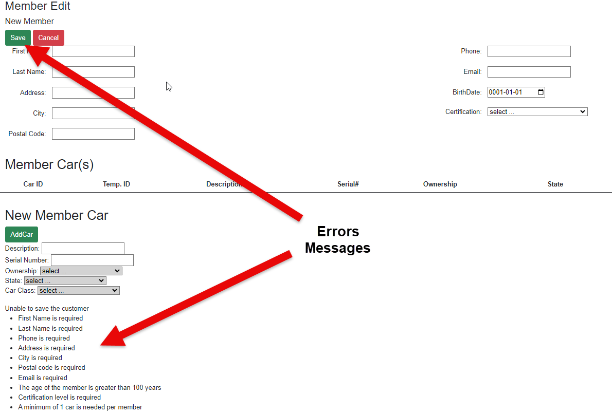
---
 

### Addding a new Car
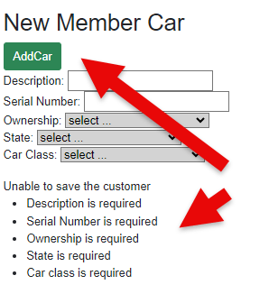
